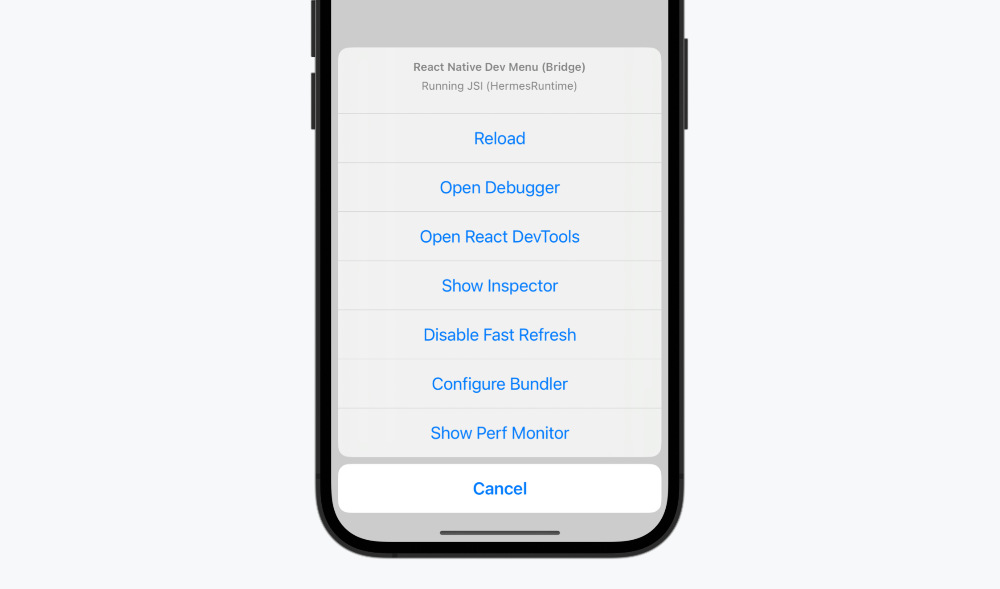

## 开启调试的快捷键

React Native 在 iOS 模拟器上支持一些快捷键操作，具体会在下文中描述。要使用快捷键请**务必确保模拟器的 Hardware 菜单中，Keyboard 选项下的"Connect Hardware Keyboard"处于开启状态**，否则按键是没有响应的。

## 访问 App 内的开发菜单

你可以通过摇晃设备或是选择 iOS 模拟器的"Hardware"菜单中的"Shake Gesture"选项来打开开发菜单。另外，如果是在 iOS 模拟器中运行，还可以按下**`Command`**`⌘` + **`D`** 快捷键，Android 模拟器对应的则是**`Command`**`⌘` + **`M`**（windows 上可能是 F1 或者 F2），或是直接在命令行中运行`adb shell input keyevent 82`来发送菜单键命令。



> 在发布（production）版本中开发者菜单将无法使用。

## 开启快速自动刷新 Fast Refresh

Fast Refresh is a React Native feature that allows you to get near-instant feedback for changes in your React components. While debugging, it can help to have [Fast Refresh](fast-refresh.md) enabled. Fast Refresh is enabled by default, and you can toggle "Enable Fast Refresh" in the React Native developer menu. When enabled, most of your edits should be visible within a second or two.

> 某些情况下自动刷新并不能顺利实施。如果碰到任何界面刷新上的问题，请尝试手动完全刷新。具体的操作就是在开发菜单中点击"Reload"选项。也可以在 iOS 模拟器中按下**`Command`**`⌘` + **`R`** ，Android 模拟器上对应的则是按两下**`R`** 。

但有些时候你必须要重新编译应用（run-ios 或是 run-android）才能使修改生效：

- 增加了新的资源(比如给 iOS 的`Images.xcassets`或是 Andorid 的`res/drawable`文件夹添加了图片)
- 更改了任何的原生代码（objective-c/swift/java）

## LogBox

Errors and warnings in development builds are displayed in LogBox inside your app.

:::note
LogBox 在发布版本（release/production）中是自动禁用的。
:::

## 控制台的错误与警告提示

Console errors and warnings are displayed as on-screen notifications with a red or yellow badge, and the number of errors or warning in the console respectively. To view a console error or warnings, tap the notification to view the full screen information about the log and to paginiate through all of the logs in the console.

These notifications can be hidden using `LogBox.ignoreAllLogs()`. This is useful when giving product demos, for example. Additionally, notifications can be hidden on a per-log basis via `LogBox.ignoreLogs()`. This is useful when there's a noisy warning that cannot be fixed, like those in a third-party dependency.

:::info
Ignore logs as a last resort and create a task to fix any logs that are ignored.
:::

```jsx
import {LogBox} from 'react-native';

// Ignore log notification by message:
LogBox.ignoreLogs(['Warning: ...']);

// Ignore all log notifications:
LogBox.ignoreAllLogs();
```

### 未捕获的错误

Unhanded JavaScript errors such as `undefined is not a function` will automatically open a full screen LogBox error with the source of the error. These errors are dismissable and minimizable so that you can see the state of your app when these errors occur, but should always be addressed.

### 语法错误

Syntax errors will automatically open a full screen LogBox error with the source of the syntax error. This error is not dismissable because it represents invalid JavaScript execution that must be fixed before continuing with your app. To dismiss these errors, fix the syntax error and either save to automatically dismiss (with Fast Refresh enabled) or cmd+r to reload (with Fast Refresh disabled).

## Chrome 开发者工具

在开发者菜单中选择"Debug JS Remotely"选项，即可以开始在 Chrome 中调试 JavaScript 代码。点击这个选项的同时会自动打开调试页面 <http://localhost:8081/debugger-ui>.(如果地址栏打开的是 ip 地址，则请自行改为 localhost)

在 Chrome 的菜单中选择`Tools → Developer Tools`可以打开开发者工具，也可以通过键盘快捷键来打开（Mac 上是**`Command`**`⌘` + **`Option`**`⌥` + **`I`**，Windows 上是**`Ctrl`** + **`Shift`** + **`I`**或是 F12）。打开[有异常时暂停（Pause On Caught Exceptions）](http://stackoverflow.com/questions/2233339/javascript-is-there-a-way-to-get-chrome-to-break-on-all-errors/17324511#17324511)选项，能够获得更好的开发体验。

> Note: on Android, if the times between the debugger and device have drifted; things such as animation, event behavior, etc., might not work properly or the results may not be accurate. Please correct this by running `` adb shell "date `date +%m%d%H%M%Y.%S%3N`" `` on your debugger machine. Root access is required for the use in real device.

> 注意：Chrome 中并不能直接看到 App 的用户界面，而只能提供 console 的输出，以及在 sources 项中断点调试 js 脚本。一些老的教程和文章会提到 React 的 Chrome 插件，这一插件目前并不支持 React Native，而且调试本身并不需要这个插件。不过你可以安装独立（非插件）版本的 React Developer Tools 来辅助查看界面布局，下文会讲述具体安装方法。

> 注意：使用 Chrome 调试目前无法观测到 React Native 中的网络请求，你可以使用功能更强大的第三方的[react-native-debugger](https://github.com/jhen0409/react-native-debugger)或是官方的[flipper](https://fbflipper.com/)（注意仅能在 0.62 以上版本可用）来观测。

### 使用自定义的 JavaScript 调试器来调试

如果想用其他的 JavaScript 调试器来代替 Chrome，可以设置一个名为`REACT_DEBUGGER`的环境变量，其值为启动自定义调试器的命令。调试的流程依然是从开发者菜单中的"Debug JS Remotely"选项开始。

被指定的调试器需要知道项目所在的目录（可以一次传递多个目录参数，以空格隔开）。例如，如果你设定了`REACT_DEBUGGER="node /某个路径/launchDebugger.js --port 2345 --type ReactNative"`，那么启动调试器的命令就应该是`node /某个路径/launchDebugger.js --port 2345 --type ReactNative /某个路径/你的RN项目目录`。

> 以这种方式执行的调试器最好是一个短进程（short-lived processes），同时最好也不要有超过 200k 的文字输出。

## Safari Developer Tools

你可以使用 Safari 来调试你的 iOS 版本的应用，而不必启用"Debug JS Remotely".

- Enable Develop menu in Safari: `Preferences → Advanced → Select "Show Develop menu in menu bar"`
- Select your app's JSContext: `Develop → Simulator → JSContext`
- Safari's Web Inspector should open which has a Console and a Debugger

虽然默认情况下可能没有启用 source map，但您可以按照[本指南](http://blog.nparashuram.com/2019/10/debugging-react-native-ios-apps-with.html)或[Youtube 视频](https://www.youtube.com/watch?v=GrGqIIz51k4)来启用 source map，并在源代码的正确位置设置断点。

然而，每次重新加载应用程序（使用实时重新加载，或通过手动重新加载）时，都会创建一个新的 JSContext。选择 "自动显示 JSContextts 的 Web 检查器(Automatically Show Web Inspectors for JSContexts)"可以帮你自动选择最新的 JSContext。

## 性能监测

你可以在开发者菜单中选择"Pref Monitor"选项以开启一个悬浮层，其中会显示应用的当前帧数。
